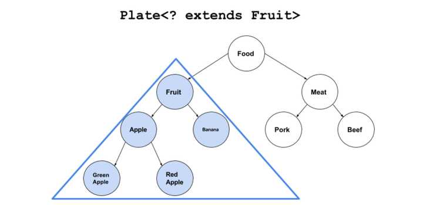
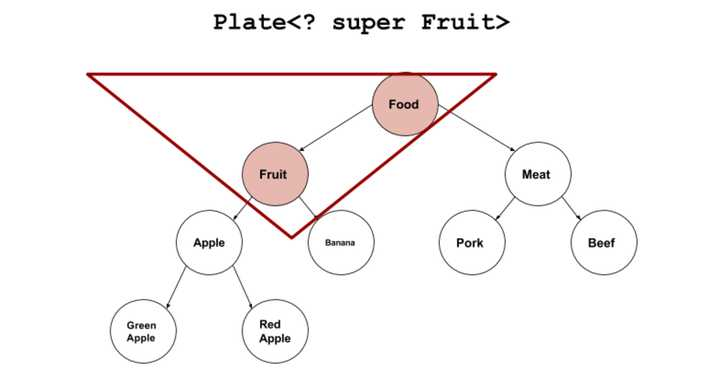

# 泛型和通配符详解

---

## 通配符

`<? extends T>`：是指 “上界通配符（Upper Bounds Wildcards）。  
`T`是上边界，能赋值为类型T和T的子类的对象。  


`<? super T>`：是指 “下界通配符（Lower Bounds Wildcards）”。  
`T`是下边界，能赋值为类型T和T的父类的对象。  


## 案例

```java
//“装苹果的盘子” 无法转换成 “装水果的盘子”
Plate<Fruit> p=new Plate<Apple>(new Apple());
//java: 不兼容的类型: com.hyd.Plate<com.hyd.Apple>无法转换为com.hyd.Plate<com.hyd.Fruit>
//就算容器里装的东西之间有继承关系，但容器之间是没有继承关系的
//于是通配符出现了。
```
```java
Plate<? extends Fruit> p=new Plate<Apple>(new Apple());

```
## 泛型的PECS原则

**Producer Extends Consumer Super**  
extends作为泛型，该数据结构作为Producer对外提供值，只能进行取值而不能写值。  
super作为泛型，该数据结构作为Producer对外提供值，只能进行取值而不能写值。

---
